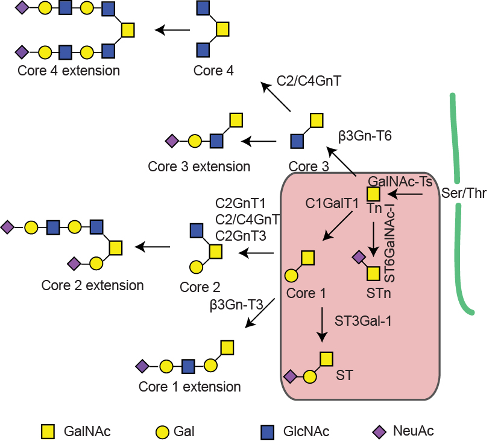

# Glyco-DIA
Here is the repository for Glyco-DIA.

The Glyco-DIA library consists of sublibraries obtained from human cell lines and human serum, and it currently covers 2,076 O-glycoproteins (11,452 unique glycopeptide sequences) and the five most common core1 O-glycan structures. Applying the Glyco-DIA library to human serum without enrichment for glycopeptides enabled us to identify and quantify 269 distinct glycopeptide sequences bearing up to 5 different core1 O-glycans from 159 glycoproteins in a singleshot analysis. The DIA method is expandable and widely applicable to different glycoproteomes, and it may represent a first step towards direct and comprehensive approach to glycoproteomics. 

## O-glycosylation pathways

## Glyco-DIA libraries

### Library description

| Library  | Description |
| ------------- | ------------- |
| HEK_SC_Comprehensive  | Multiple MS runs (high pH reverse phase fractionated) in HCD-MS2 DDA mode, LWAC VVA enriched samples from HEK SC|
| HEK_SC_Single_SingleRun | Single MS run in HCD-MS2 DDA mode, LWAC VVA enriched samples from HEK SC |
| HEK_WT_Comprehensive	| Multiple MS runs (high pH reverse phase fractionated) in HCD-MS2 DDA mode, LWAC Jacalin enriched samples from HEK293 WT |
| HepG2_SC_Comprehensive |	Multiple MS runs (high pH reverse phase fractionated) in HCD-MS2 DDA mode, LWAC VVA enriched samples from HepG2 SC |
| HepG2_SC_Secretome_SingleRun |	Single MS run in HCD-MS2 DDA mode, LWAC VVA enriched samples from HEK SC secretome |
| HepG2_SC_SingleRun |	Single MS run in HCD-MS2 DDA mode, LWAC VVA enriched samples from HEK SC |
| HepG2_WT_Comprehensive |	Multiple MS runs (high pH reverse phase fractionated) in HCD-MS2 DDA mode, LWAC Jacalin enriched samples from HepG2 WT |
| HepG2_WT_SingleRun |	Single MS run in HCD-MS2 DDA mode, LWAC Jacalin enriched samples from HepG2 WT |
| M3T4_SC_Comprehensive |	Multiple MS runs (high pH reverse phase fractionated) in HCD-MS2 DDA mode, LWAC VVA enriched samples from M3T4 SC |
| OVCAR3_SC_Comprehensive |	Multiple MS runs (high pH reverse phase fractionated) in HCD-MS2 DDA mode, LWAC VVA enriched samples from OVCAR3 SC |
| Serum_DIA_Comprehensive |	Multiple MS runs (with and without Top2 depletion, high pH reverse phase fractionated) in HCD-MS2 DDA mode, LWAC Jacalin enriched samples from human serum |
| Serum_SiteSpecific |	Single MS run in ETD/HCD-MS2 DDA mode, LWAC Jacalin enriched samples from human serum |

### in silico library

Due to the limitation of file size on GitHub, we share all the in silico libraries on [_GoogleDrive_](https://drive.google.com/drive/folders/1v-UikCNc7SUhB7vFPQ5oL06O2pN1nwDg?usp=sharing).

| Library  | Original structure | in silico structure  | Source |
| ------------- | ------------- | ------------- | ------------- |
| Naked_Library_Cell_Tn.xls  | Tn | Non-glycosylated  | Merged SimpleCell lines|
| T_Library_Cell_Tn.xls  | Tn | T | Merged SimpleCell lines|
| STn_Library_Cell_Tn.xls  | Tn | SiaTn  | Merged SimpleCell lines|
| mST_Library_Cell_Tn.xls  | Tn | mSiaT  | Merged SimpleCell lines|
| dST_Library_Cell_Tn.xls  | Tn | dSiaT  | Merged SimpleCell lines|
| Naked_Library_Cell_T.xls  | T | Non-glycosylated  | Merged WT cell lines|
| Tn_Library_Cell_T.xls  | T | Non-glycosylated  | Merged WT cell lines|
| STn_Library_Cell_T.xls  | T | SiaTn  | Merged WT cell lines|
| mST_Library_Cell_T.xls  | T | mSiaT  | Merged WT cell lines|
| dST_Library_Cell_T.xls  | T | dSiaT  | Merged WT cell lines|
| Naked_Library_Serum.xls  | T&Tn | Non-glycosylated  | Serum|
| Tn_Library_Serum.xls  | T&Tn | Tn  | Serum|
| T_Library_Serum.xls  | T&Tn | T | Serum|
| STn_Library_Serum.xls  | T&Tn | SiaTn  | Serum|
| mST_Library_Serum.xls  | T&Tn | mSiaT  | Serum|
| dST_Library_Serum.xls  | T&Tn | dSiaT  | Serum|

The R script for in silico library generation is at `R/in silico Library.R` and the related example file is at `test/test_Tn.xls`

## Site Specific Glyco-DIA

The relavant raw and result files for site-specific Glyco-DIA are avaible on the same address of [_GoogleDrive_](https://drive.google.com/drive/folders/1v-UikCNc7SUhB7vFPQ5oL06O2pN1nwDg?usp=sharing).